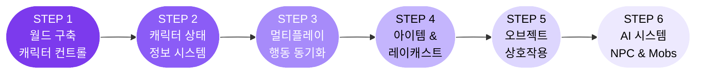

<!-- 상단 배너 -->

  
  
  
  

---
## 우리는 누구인가요?
> **아울게임즈단**은 성공회대학교 IT동아리 **S.OWL** 안의 게임 개발 스터디 그룹입니다.
유니티(Unity) 엔진을 기반으로 게임 제작을 함께 배우고,  
서로의 프로젝트를 공유하며 성장하는 **게임 개발 커뮤니티**예요.
 

  

---
## 우리가 함께 하는 것들
<table>
  <tr>
    <td width="50%" valign="top">
### [ 스터디 활동 ]
- 뉴비 맞춤형 **단계별 커리큘럼**
- 실전 게임 **프로젝트 제작**
- 정기적인 **코드 리뷰&피드백**
- **프로젝트 사례 공유**

    </td>
    <td width="50%" valign="top">

### [ 스터디 혜택 ]
- **유니티 유료 에셋** 배포
- 외부 **상용 에셋** 지원
- 게임 개발 **꿀팁 & 자료실**
    </td>
  </tr>
</table>

---
## 뉴비 맞춤 커리큘럼
> 처음 시작하는 분도 따라올 수 있도록 **단계별로** 진행해요!

<b>커리큘럼 상세 보기 (클릭)</b>

| 단계 | 주제 | 학습 내용 |
|:---:|:---|:---|
| **1** | 월드 구축 & 캐릭터 컨트롤 | 씬 구성, Player Controller, Camera Follow |
| **2️** | 캐릭터 상태 정보 | HP/MP, 스탯 시스템, ScriptableObject 활용 |
| **3️** | 멀티 접속 & 동기화 | 네트워크 기초, 행동 동기화 구현 |
| **4️** | 아이템 & 레이캐스트 | 인벤토리, Raycast 기반 인터랙션 |
| **5️** | 오브젝트 상호작용 | 트리거, 이벤트 시스템 |
| **6️** | AI 만들기 | NPC 대화, 몬스터 AI, Behaviour Tree 입문 |

---

## 사용하는 도구들

  

  <b>Unity Engine</b> · <b>C#</b> · <b>Git/GitHub</b> · <b>Visual Studio</b> · <b>Blender</b>

---

  

  <b>Owl Games</b> · Made with by SOWL · 성공회대학교 IT동아리

